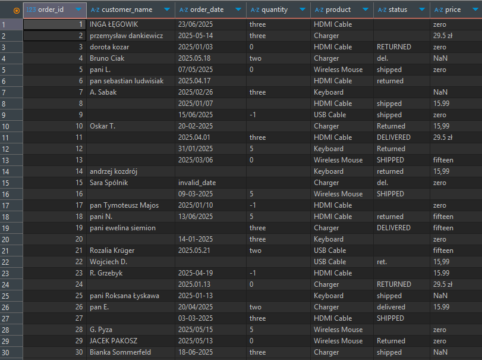
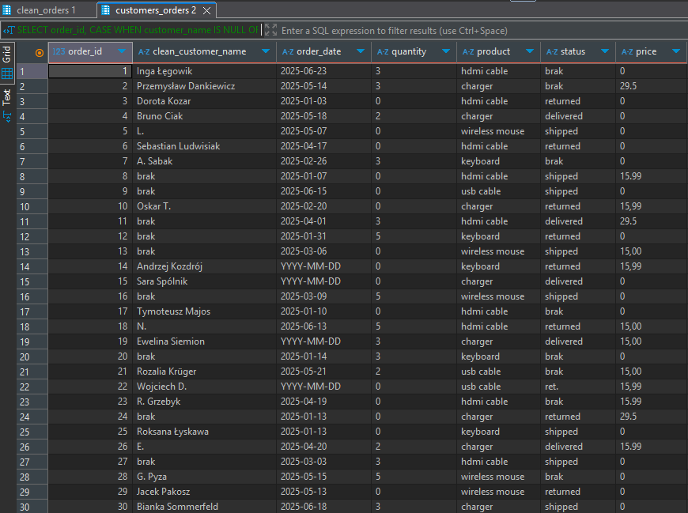
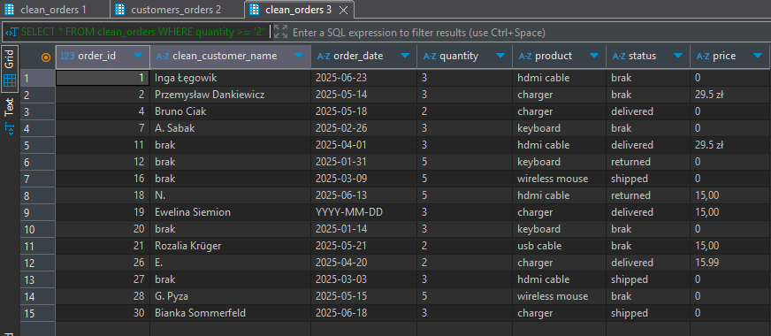

# data-cleaning-orders
Projekt SQL czyszczenia danych zamówień (PostgreSQL)

Ten projekt przedstawia podstawpwe sposób czyszczenia nieuporządkowanych danych z zamówień klientów przy użyciu SQL w PostgreSQL. 
W danych wejściowych występowały błędy typowe dla danych operacyjnych: 
-różne formaty dat, 
-tekstowe wartości liczbowe, 
-brakujące dane oraz niespójne statusy i ceny.

## Zakres czyszczenia:
- normalizacja imion i nazwisk klientów (usuwanie "Pan", "Pani", poprawa wielkości liter),
- konwersja różnych formatów dat na jeden (YYYY-MM-DD),
- zamiana wartości tekstowych (np. "two", "-1") na liczby całkowite,
- czyszczenie statusów (np. "del." → "delivered"),
- poprawienie wartości cenowych.

## Technologie
- PostgreSQL
- CASE, REGEXP_REPLACE, TO_DATE, CAST, INITCAP, ILIKE
- CREATE VIEW

## Pliki projektu
- clean_orders.sql – kod czyszczący dane
- clean_orders_view.sql – widok SQL z gotowymi danymi
- README.md – opis projektu
- raw_data.csv – (opcjonalnie) dane źródłowe

## Efekt
Dane wyczyszczone zostały zapisane jako widok 'clean_orders', gotowy do analizy.

### Przykład: dane przed czyszczeniem ('customers_orders')

Zrzut ekranu przedstawia przykładowe rekordy z tabeli wejściowej przed czyszczeniem. Występują m.in.:
- niejednolite formaty dat (np. '12-06-2023', '2023/06/15', NULL),
- liczby zapisane słownie ('three', 'two') lub niepoprawnie ('-1', '0'),
- ceny zawierające tekst ('zero', 'NaN', '15.99 zł'),
- statusy w różnych wersjach ('del.', 'DELIVERED', pustki),
- tytuły w nazwach klientów ('Pan', 'Pani', spacje, NULL).

## Efekt po czyszczeniu danych

Poniżej przykład widoku 'clean_orders' z oczyszczonymi danymi:

### Przykład zastosowania widoku
 
SELECT * 
FROM clean_orders 
  WHERE quantity >= '2';

## Uwaga dotycząca danych

Wszystkie dane użyte w tym projekcie są całkowicie fikcyjne.  
Zostały wymyślone na potrzeby nauki i nie zawierają żadnych informacji wrażliwych ani danych osobowych.

## Autor
Katarzyna Wróblewska
katarzynawroblewska.data@gmail.com
